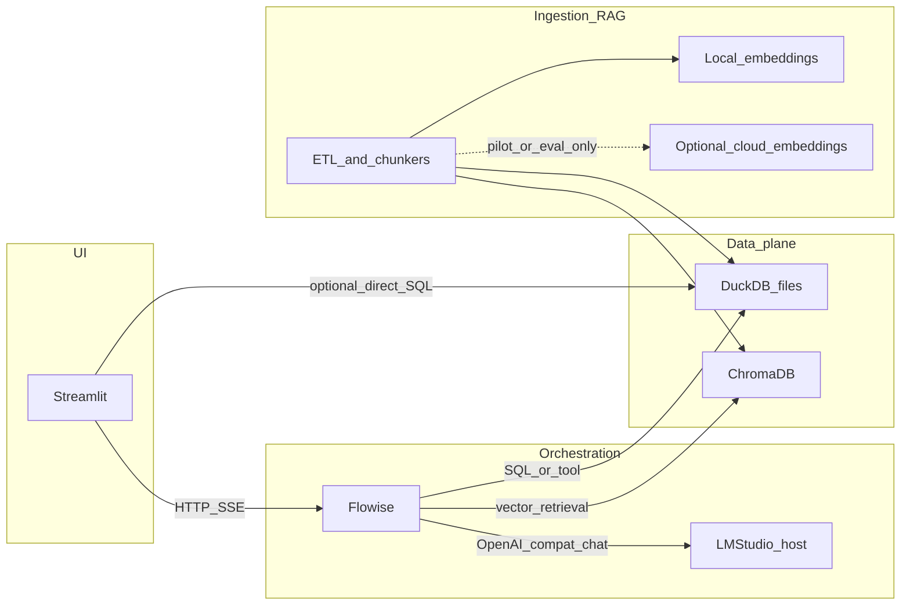

# Lab manager: Streamlit, Flowise, DuckDB, Chroma, Docker (plan v2)

## Where you are today

Your repo [`d:\Vanessa\AI_project\Lab_manager\Scripts\`](d:\Vanessa\AI_project\Lab_manager\Scripts\) is effectively greenfield (minimal [`README.txt`](d:\Vanessa\AI_project\Lab_manager\Scripts\README.txt)). This v2 plan adds: **phased RAG (A then B)**, **local embedding path for confidentiality**, and **Brazilian Portuguese–first** product assumptions.

## Target architecture (logical)

**Roles**

- **Streamlit**: Primary UX for chat, tables, charts, and report export. Prefer a thin client calling orchestration and stable data access patterns.
- **Flowise**: Visual flows for agents, tools, and (in phase A) end-to-end RAG wiring.
- **LM Studio (host)**: Local chat/completions via OpenAI-compatible base URL; containers typically reach the host via `host.docker.internal` on Windows.
- **DuckDB**: OLAP over CSV/Parquet/lab exports; registry and curated views (especially after phase B).
- **Chroma**: Vector store; persist with a Docker volume.

## RAG strategy: phase A (prototype) then phase B (production shape)

### Phase A — RAG inside Flowise (quick prototype)

Use Flowise document loaders, text splitters, Chroma vector store nodes, and a conversational agent.

- **Use this phase to validate**: document formats, chunk sizes, typical user questions, and whether Flowise’s built-in splitting is good enough for your PDFs/tables.
- **Deliberately accept**: weaker lineage, manual flow versioning, and less testable ingest logic.

### Phase B — Python ingestion + Flowise for query-time only (migration)

When prototypes stabilize (or when you need auditability, re-ingest at scale, or ACL-aware retrieval), move **extract → chunk → embed → metadata** into Python (see previous v1 plan steps). Flowise keeps **retrieval + generation + tools**; Chroma becomes populated by jobs you can schedule and reproduce.

**Practical migration tip**: from day one of phase A, use **consistent Chroma collection names and metadata keys** (`doc_id`, `source`, `project`, `language`) so phase B can re-index into the same shape without rewriting the Flowise retrieval node.

**Libraries when you implement phase B**: **LlamaIndex** remains a strong default for a small team; **LangChain** is fine if you prefer it.

## Embeddings: privacy-first default, optional cloud for comparison

- **Production / sensitive R&D**: prefer **local** embedding endpoints (LM Studio embedding server, `text-embedding` compatible services, or a small dedicated embedding container) so chunk text does not leave your environment.
- **`gemini-embedding-001`**: reasonable for **offline benchmarking** (compare recall vs local multilingual models on a fixed golden set) if you accept sending evaluation snippets to Google during the test window—not as the long-term default if leakage is a concern.

**Multilingual local models (PT-BR + occasional English)** — pick one family and standardize vector dimension across the project:

- **BGE-M3** (multilingual, strong cross-lingual retrieval): a common choice when users ask in Portuguese but some sources are English.
- **E5-style multilingual instruct models** (e.g. multilingual E5 variants where available in your runtime): solid general-purpose retrieval.
- **Nomic Embed** variants with multilingual support: lightweight ops-wise depending on packaging.

**Operational note**: ensure the **same** embedding model (and pooling/normalization assumptions) is used for **indexing and querying**. Mixed models silently destroy retrieval quality.

## Brazilian Portuguese–first (with English documents)

**UX and generation**

- Default **system prompts** and **Streamlit UI copy** in **pt-BR**; instruct the model to answer in **pt-BR** unless the user switches language.
- For **English-only source** chunks, instruct: answer in pt-BR while citing terminology from the source when needed (reduces “forced translation” errors in technical text).

**Retrieval across languages**

- Multilingual embeddings help **pt-BR questions** retrieve **English** passages (cross-lingual semantic search). Still validate empirically on your corpus.
- Optional metadata field `source_language` (`pt`, `en`, `mixed`) from lightweight detection or file heuristics; use for **filtering**, **boosting**, or **UI badges**—not as a hard gate until you measure impact.

**Chunking**

- Portuguese uses more function words and longer sentences in some genres; avoid assuming English-only sentence tokenization. Prefer splitters that are **structure-aware** (headings, tables) and tune overlap/size on real lab PDFs.

**Evaluation**

- Build the **golden set primarily in pt-BR** (questions users will actually ask), including cases where the answer must synthesize **mixed** pt/en evidence.

## Important design caveat (updated)

**Local LLM** (LM Studio) addresses confidentiality for **generation**. **Embeddings** must be treated separately: cloud embedding APIs send **chunk text** out. v2 assumes **local embeddings for production**, cloud only for controlled comparison if needed.

## Multi-agent expectations

Flowise supports agent/tool patterns visually; if you outgrow it, migrate orchestration to **LangGraph / FastAPI** while keeping DuckDB + Chroma schemas stable.

Expose a stable **HTTP contract** from Streamlit (e.g. `POST /lab/ask`) that can call Flowise’s prediction API now and be swapped later.

## Analytics (OLAP) with DuckDB

- Raw land → curated Parquet/DuckDB views; put rollups in **SQL views** shared by Streamlit and any SQL tool in Flowise.
- Prefer **parameterized / allow-listed SQL** over unconstrained LLM-generated SQL in production.

## Docker layout (suggested)

- `docker-compose.yml`: `streamlit`, `flowise`, `chroma`, volumes `data_duckdb`, `data_chroma`, `data_raw`, `flowise_data`; optional `postgres` for Flowise persistence; optional `minio` for blobs.
- **LM Studio**: usually on the host; document Windows host access clearly.
- **Secrets**: `.env` not committed; separate keys for any cloud eval vs production.

## Repository structure (when you implement)

- `apps/streamlit/` — UI
- `apps/flowise/` — exported flows JSON + notes
- `packages/ingest/` — phase B pipeline (and shared schemas)
- `infra/docker/` — compose + Dockerfiles

## Suggestions for a seamless system (high leverage)

- **Stable vector metadata contract** from phase A onward to ease phase B migration.
- **Idempotent ingestion** in phase B (hash-based upserts, stale chunk deletion).
- **Tracing** for “wrong answer” debugging (Flowise logs + ingest job logs).
- **ACL enforcement** in retrieval metadata filters—not LLM politeness alone.

## What this plan still does not prescribe

Exact Flowise graphs, DuckDB schemas, and report templates depend on file formats and compliance; refine after inventorying real document types (PDF-heavy vs Excel exports vs instrument logs).
