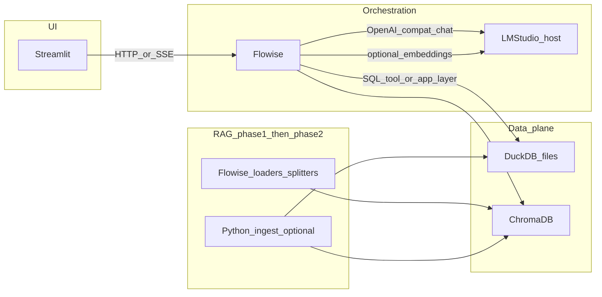

# Lab R&D stack: Streamlit, Flowise, LM Studio, DuckDB, Chroma, Docker

Your direction is sound and aligns with the repo’s existing draft ([`.cursor/plans/lab_ai_stack_plan_eca7f5dc.plan.md`](d:\Vanessa\AI_project\Lab_manager\Scripts\.cursor\plans\lab_ai_stack_plan_eca7f5dc.plan.md)). Below is a consolidated architecture plus **starter-friendly RAG options**, **embedding comparison**, and **pt-BR** considerations.

## Logical architecture

**Roles (unchanged from your intent)**  
- **Streamlit**: chat, tables, charts, report export (keep it a thin client where possible).  
- **Flowise**: visual multi-step flows, RAG + tools; good for rapid iteration.  
- **LM Studio**: local chat completions; can also host **local embedding** endpoints if you expose an OpenAI-compatible embeddings route (depends on LM Studio version/features—verify embedding server for your chosen model).  
- **DuckDB**: OLAP over Parquet/CSV/lab exports; **views** as the single source of truth for metrics the UI and any “SQL tool” use.  
- **Chroma**: persisted vectors + rich **metadata** (language, project, doc type, ACL).

**Important caveat**: `gemini-embedding-001` sends text to Google’s API. Use it only if that matches your confidentiality policy for the pilot; **BGE-M3 stays on-box** for stricter R&D data. Design a small **`EmbeddingClient` interface** (same chunk in → vector out) so you can swap providers without rewriting Chroma upserts.

---

## RAG: good starter options (ordered by speed vs maintainability)

| Phase | What you do | Good for |
|--------|----------------|----------|
| **1 — RAG inside Flowise** | Document loaders → text splitter → Chroma → retrieval chain / agent | Fastest demo; learn prompts and retrieval knobs |
| **2 — Python ingestion + Flowise query-only** | Python: extract → normalize metadata in **DuckDB registry** → chunk → embed → Chroma; Flowise: only retrieve + answer + tools | Production-ish lineage, idempotent re-ingest, tests |

**Libraries (when you move to Phase 2)**  
- **LlamaIndex**: approachable “documents → index → query” mental model; integrates cleanly with Chroma and SQL-ish backends.  
- **LangChain**: very common; more surface area. Either is fine; pick one and avoid mixing deeply early on.

**Seam between phases**: keep stable **`chunk_id`**, **`doc_id`**, **`source_uri`**, **`content_hash`**, and **`lang`** in Chroma metadata; mirror the same keys in DuckDB. Then Flowise (or Streamlit) always filters/retrieves on those fields.

---

## Portuguese (pt-BR) + occasional English

- **Chunking**: use a splitter that respects paragraphs and tables; for messy PDFs, prefer a pipeline that preserves headings (better retrieval for protocols).  
- **Metadata**: set `lang` per document (or per chunk if mixed); at query time you can **boost or filter** (e.g. prefer `lang=pt` when user writes in pt-BR).  
- **Cross-lingual retrieval**: multilingual embeddings (e.g. **BGE-M3**) often handle “query in Portuguese, chunk in English” better than English-only models—still **measure** on your real corpus.  
- **Prompting**: system prompts in **pt-BR**; allow the model to cite sources; instruct it to answer in pt-BR unless the user asks otherwise.

---

## Comparing BGE-M3 (local) vs gemini-embedding-001

Do this **before** large-scale ingestion:

1. **Golden set**: 20–50 real questions + expected chunk IDs (or “must contain” snippets) from your lab docs (mix pt-BR and English).  
2. **Same chunks, two indexes** (or one index with `embedding_model` in metadata): ingest identical `chunk_id` list twice with different vectors (two Chroma collections is simplest).  
3. **Metrics**: recall@k, MRR, and a qualitative rubric (wrong project / wrong assay contamination).  
4. **Operational**: latency, batching cost (Gemini API vs local GPU/CPU), and **privacy** checklist.

This gives you an evidence-based choice instead of assuming one embedding fits all instrument logs and SOPs.

---

## Multi-agent expectations

Flowise is excellent for **prototyping** agent + tool graphs; it is not a full agent-ops platform. Plan a **stable HTTP contract** from Streamlit (e.g. `POST /lab/ask` → Flowise prediction API today; swap to LangGraph/FastAPI later without changing the UI much).

---

## DuckDB + “AI writes SQL” safety

For seamless analytics: put business logic in **SQL views**. For LLM access, prefer **parameterized templates** or **allow-listed queries** over unconstrained generated SQL, especially once multiple users or projects exist.

---

## Docker (practical layout)

- **Compose services**: `streamlit`, `flowise`, `chroma`; volumes for `data_chroma`, `data_duckdb`, `data_raw`, `flowise_data`.  
- **LM Studio**: usually **on the host** (GPU); containers reach it via `host.docker.internal` on Windows; document the base URL in `.env.example`.  
- **Secrets**: `.env` (not committed) for API keys (Gemini if used), paths, and any DB credentials if you add Postgres for Flowise later.

Suggested repo layout when you implement (matches the existing draft): `apps/streamlit/`, `apps/flowise/` (exported flows), `packages/ingest/`, `infra/docker/`.

---

## Extra suggestions for a “seamless” lab system

- **Idempotent ingestion**: upsert by content hash; delete orphaned chunks after re-run.  
- **ACL in data, not in prompts**: filter Chroma/DuckDB by project/tags; do not rely on the model to self-police.  
- **Tracing**: log flow id, retrieval ids, and final answer for debugging wrong citations.  
- **Reports**: Streamlit can render tables/charts from DuckDB and attach “sources used” from retrieval metadata for auditability.

---

## What to decide early (no blocking questions required)

You already stated: Flowise-first RAG, then Python ingestion; local LM Studio; DuckDB + Chroma; Docker; pt-BR primary. The only policy choice to keep explicit is **whether Gemini embeddings are acceptable** for the pilot given document sensitivity; the plan above assumes you will **compare** and possibly keep everything local after evaluation.
